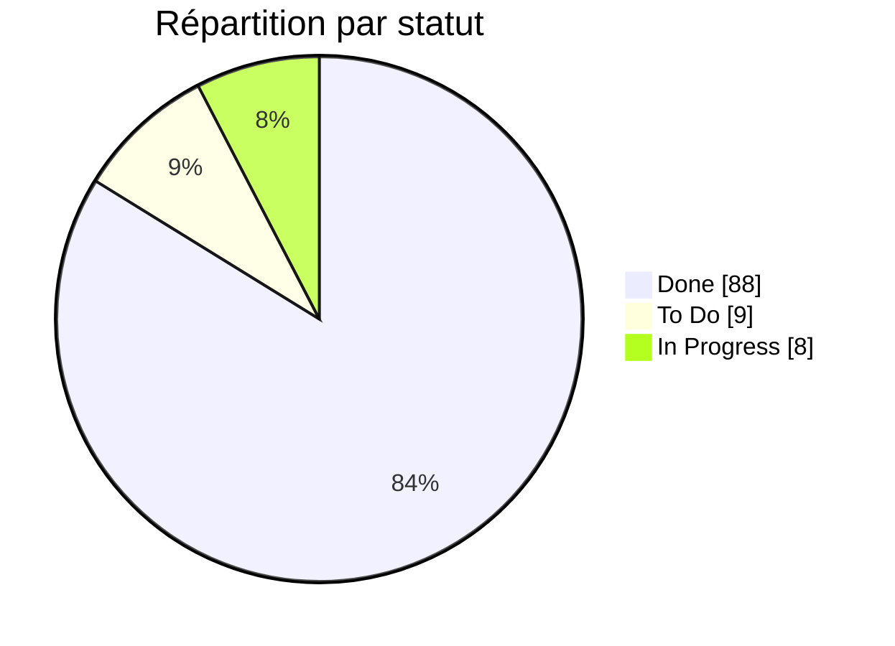

# Azure DevOps Export - Groupe30Apocalipssi

- Project: `Groupe30Apocalipssi`
- Team: `Groupe30Apocalipssi Team`
- Board: `Issues`
- Generated at: `2026-07-03 13:48:49`
- Backlogs exported: `3`
- Sprints / iterations exported: `7`
- Work items exported: `105`
- Attachments exported: `0`

## Résumé

| Indicateur | Valeur |
|---|---:|
| Total | 105 |
| Done | 88 |
| In Progress | 8 |
| To Do | 9 |
| Avancement | 84% |

## Avancement par artefact (7)

| Artefact | Terminé | En cours | À faire | Total | Avancement |
|---|---:|---:|---:|---:|---|
| ReleasePlanning | 7 | 0 | 0 | 7 | ██████████ 100% |
| CustomerJourney | 7 | 0 | 0 | 7 | ██████████ 100% |
| VisionBoard | 8 | 0 | 0 | 8 | ██████████ 100% |
| Backlog | 8 | 0 | 0 | 8 | ██████████ 100% |
| SprintBacklog | 8 | 0 | 0 | 8 | ██████████ 100% |
| StoryMap | 8 | 0 | 0 | 8 | ██████████ 100% |
| Personas | 3 | 2 | 0 | 5 | ██████░░░░ 60% |

## Charge par membre (8)

| Membre | Terminé | Restant | Total | Avancement |
|---|---:|---:|---:|---|
| Kevin TCHIKAYA | 12 | 10 | 22 | █████░░░░░ 55% |
| Keziah PERFILLON | 19 | 0 | 19 | ██████████ 100% |
| Nick BEKOLO | 18 | 0 | 18 | ██████████ 100% |
| Julien CANTAU | 9 | 4 | 13 | ███████░░░ 69% |
| Helena MOUGAMMADALY | 8 | 3 | 11 | ███████░░░ 73% |
| Yanis MEDJADI | 9 | 0 | 9 | ██████████ 100% |
| Non assigné | 7 | 0 | 7 | ██████████ 100% |
| Mohamed Abdelmalek DORBANI | 6 | 0 | 6 | ██████████ 100% |

## Pièces jointes (0)

_Aucune pièce jointe._

## Board

- Name: `Issues`
- ID: `5c7d8a82-e017-4957-aca8-b161d14a3cc7`
- URL: `https://dev.azure.com/ktchikaya/68d931cc-b8aa-465c-a11a-895541d091a5/2749232e-e766-4d33-b8ab-a679bbe8df88/_apis/work/boards/5c7d8a82-e017-4957-aca8-b161d14a3cc7`

### Board Columns

| Name | State mappings |
|---|---|
| To Do | Issue: To Do |
| Doing | Issue: Doing |
| Done | Issue: Done |

### Board Rows

| Name |
|---|
|  |

## Backlogs (3)

| Name | ID | Type | Rank | Default type | Work item types | Hidden |
|---|---|---|---:|---|---|---|
| Epics | Microsoft.EpicCategory | portfolio | 3 | Epic | Epic | False |
| Issues | Microsoft.RequirementCategory | requirement | 2 | Issue | Issue | False |
| Tasks | Microsoft.TaskCategory | task | 1 | Task | Task | False |

## Sprints / Iterations (7)

| Name | Path | Start | Finish | Time frame |
|---|---|---|---|---|
| Cadrage Lundi Matin (9h00 – 12h30) | Groupe30Apocalipssi\Cadrage Lundi Matin (9h00 – 12h30) | 2026-06-29T00:00:00Z | 2026-06-29T00:00:00Z | past |
| Sprint 1 Lundi Après-midi (14h00 – 18h00) | Groupe30Apocalipssi\Sprint 1 Lundi Après-midi (14h00 – 18h00) | 2026-06-29T00:00:00Z | 2026-06-29T00:00:00Z | past |
| Sprint 2 Mardi Matin (9h00 – 12h30) | Groupe30Apocalipssi\Sprint 2 Mardi Matin (9h00 – 12h30) | 2026-06-30T00:00:00Z | 2026-06-30T00:00:00Z | past |
| Sprint 3 Mardi Après-midi (14h00 – 18h00) | Groupe30Apocalipssi\Sprint 3 Mardi Après-midi (14h00 – 18h00) | 2026-06-30T00:00:00Z | 2026-06-30T00:00:00Z | past |
| Sprint 4 Mercredi Matin (9h00 – 12h30) | Groupe30Apocalipssi\Sprint 4 Mercredi Matin (9h00 – 12h30) | 2026-07-01T00:00:00Z | 2026-07-01T00:00:00Z | past |
| Sprint 5 Mercredi Après-midi (14h00 – 18h00) | Groupe30Apocalipssi\Sprint 5 Mercredi Après-midi (14h00 – 18h00) | 2026-07-01T00:00:00Z | 2026-07-01T00:00:00Z | past |
| sprint 6 Jeudi | Groupe30Apocalipssi\sprint 6 Jeudi | 2026-07-02T00:00:00Z | 2026-07-02T00:00:00Z | current |

## Work Items (105)

### Epic (1)

| ID | Title | Type | State | Board column | Iteration | Assigned to | Changed | Tags | 📎 |
|---:|---|---|---|---|---|---|---|---|---:|
| [1](https://dev.azure.com/ktchikaya/Groupe30Apocalipssi/_workitems/edit/1) | EduTutor IA | Epic | Doing | Doing | Groupe30Apocalipssi\Sprint 1 Lundi Après-midi (14h00 – 18h00) | Kevin TCHIKAYA | 2026-07-01T07:44:01.26Z |  |  |

### Issues (3)

| ID | Title | Type | State | Board column | Iteration | Assigned to | Changed | Tags | 📎 |
|---:|---|---|---|---|---|---|---|---|---:|
| [97](https://dev.azure.com/ktchikaya/Groupe30Apocalipssi/_workitems/edit/97) | Sécurisation LLM 2/2 | Issue | Doing | Doing | Groupe30Apocalipssi\Sprint 5 Mercredi Après-midi (14h00 – 18h00) | Kevin TCHIKAYA | 2026-07-02T06:48:31.56Z |  |  |
| [8](https://dev.azure.com/ktchikaya/Groupe30Apocalipssi/_workitems/edit/8) | Personas | Issue | Doing | Doing | Groupe30Apocalipssi\Sprint 4 Mercredi Matin (9h00 – 12h30) | Helena MOUGAMMADALY | 2026-07-01T13:40:42.537Z |  |  |
| [65](https://dev.azure.com/ktchikaya/Groupe30Apocalipssi/_workitems/edit/65) | Gestion Agile | Issue | Doing | Doing | Groupe30Apocalipssi\Sprint 1 Lundi Après-midi (14h00 – 18h00) | Kevin TCHIKAYA | 2026-07-01T09:44:58.92Z |  |  |

### Task (4)

| ID | Title | Type | State | Board column | Iteration | Assigned to | Changed | Tags | 📎 |
|---:|---|---|---|---|---|---|---|---|---:|
| [77](https://dev.azure.com/ktchikaya/Groupe30Apocalipssi/_workitems/edit/77) | Réestimer les User Stories | Task | Doing |  | Groupe30Apocalipssi\Sprint 1 Lundi Après-midi (14h00 – 18h00) | Kevin TCHIKAYA | 2026-07-03T08:45:30.113Z |  |  |
| [14](https://dev.azure.com/ktchikaya/Groupe30Apocalipssi/_workitems/edit/14) | Relecture et mise en forme finale | Task | Doing |  | Groupe30Apocalipssi\Sprint 4 Mercredi Matin (9h00 – 12h30) | Helena MOUGAMMADALY | 2026-07-01T13:40:36.933Z | Personas |  |
| [13](https://dev.azure.com/ktchikaya/Groupe30Apocalipssi/_workitems/edit/13) | Vérifier cohérence avec Vision Board et Customer Journey | Task | Doing |  | Groupe30Apocalipssi\Sprint 4 Mercredi Matin (9h00 – 12h30) | Helena MOUGAMMADALY | 2026-07-01T13:40:31.903Z | Personas |  |
| [76](https://dev.azure.com/ktchikaya/Groupe30Apocalipssi/_workitems/edit/76) | Mettre à jour le Sprint Backlog | Task | Doing |  | Groupe30Apocalipssi\Sprint 1 Lundi Après-midi (14h00 – 18h00) | Kevin TCHIKAYA | 2026-07-01T09:47:04.68Z |  |  |

77 - Réestimer les User Stories

réestimer les User Stories impactées.

14 - Relecture et mise en forme finale

Relecture et homogénéisation.

13 - Vérifier cohérence avec Vision Board et Customer Journey

Vérifier la cohérence avec les autres artefacts.

76 - Mettre à jour le Sprint Backlog

Ajouter les tâches : 

benchmark

changement du modèle

tests

validation

mise à jour de la configuration

documentation

### To Do (9)

| ID | Title | Type | State | Board column | Iteration | Assigned to | Changed | Tags | 📎 |
|---:|---|---|---|---|---|---|---|---|---:|
| [107](https://dev.azure.com/ktchikaya/Groupe30Apocalipssi/_workitems/edit/107) | MVP 1.1.0 | Task | To Do |  | Groupe30Apocalipssi\sprint 6 Jeudi | Kevin TCHIKAYA | 2026-07-03T11:48:36.173Z |  |  |
| [106](https://dev.azure.com/ktchikaya/Groupe30Apocalipssi/_workitems/edit/106) | Release 2 | Issue | To Do | To Do | Groupe30Apocalipssi\sprint 6 Jeudi | Kevin TCHIKAYA | 2026-07-03T11:48:29.23Z |  |  |
| [86](https://dev.azure.com/ktchikaya/Groupe30Apocalipssi/_workitems/edit/86) | Rédiger la note de sécurité | Task | To Do |  | Groupe30Apocalipssi\Sprint 5 Mercredi Après-midi (14h00 – 18h00) | Kevin TCHIKAYA | 2026-07-01T13:51:27.4Z |  |  |
| [85](https://dev.azure.com/ktchikaya/Groupe30Apocalipssi/_workitems/edit/85) | Ajouter le test GitHub Actions | Task | To Do |  | Groupe30Apocalipssi\Sprint 5 Mercredi Après-midi (14h00 – 18h00) | Kevin TCHIKAYA | 2026-07-01T13:51:23.88Z |  |  |
| [80](https://dev.azure.com/ktchikaya/Groupe30Apocalipssi/_workitems/edit/80) | Rédiger les tests adversariaux | Task | To Do |  | Groupe30Apocalipssi\Sprint 5 Mercredi Après-midi (14h00 – 18h00) | Kevin TCHIKAYA | 2026-07-01T13:51:17.38Z |  |  |
| [64](https://dev.azure.com/ktchikaya/Groupe30Apocalipssi/_workitems/edit/64) | Migration technique (code) | Issue | To Do | To Do | Groupe30Apocalipssi\Sprint 4 Mercredi Matin (9h00 – 12h30) | Julien CANTAU | 2026-07-01T13:41:44.873Z |  |  |
| [75](https://dev.azure.com/ktchikaya/Groupe30Apocalipssi/_workitems/edit/75) | Valider les performances | Task | To Do |  | Groupe30Apocalipssi\Sprint 4 Mercredi Matin (9h00 – 12h30) | Julien CANTAU | 2026-07-01T13:41:38.783Z |  |  |
| [74](https://dev.azure.com/ktchikaya/Groupe30Apocalipssi/_workitems/edit/74) | Modifier la configuration | Task | To Do |  | Groupe30Apocalipssi\Sprint 4 Mercredi Matin (9h00 – 12h30) | Julien CANTAU | 2026-07-01T13:41:33.717Z |  |  |
| [73](https://dev.azure.com/ktchikaya/Groupe30Apocalipssi/_workitems/edit/73) | Installer le nouveau modèle | Task | To Do |  | Groupe30Apocalipssi\Sprint 4 Mercredi Matin (9h00 – 12h30) | Julien CANTAU | 2026-07-01T13:41:27.83Z |  |  |

### In Progress (0)

_No work items._

### Done (88)

| ID | Title | Type | State | Board column | Iteration | Assigned to | Changed | Tags | 📎 |
|---:|---|---|---|---|---|---|---|---|---:|
| [78](https://dev.azure.com/ktchikaya/Groupe30Apocalipssi/_workitems/edit/78) | Préparer la démonstration | Task | Done |  | Groupe30Apocalipssi\Sprint 1 Lundi Après-midi (14h00 – 18h00) | Kevin TCHIKAYA | 2026-07-03T08:45:17.587Z |  |  |
| [96](https://dev.azure.com/ktchikaya/Groupe30Apocalipssi/_workitems/edit/96) | Revue des release planning | Task | Done |  | Groupe30Apocalipssi\Sprint 1 Lundi Après-midi (14h00 – 18h00) | Kevin TCHIKAYA | 2026-07-03T08:45:11.957Z |  |  |
| [37](https://dev.azure.com/ktchikaya/Groupe30Apocalipssi/_workitems/edit/37) | Vérifier cohérence avec Product Backlog | Task | Done |  | Groupe30Apocalipssi\Cadrage Lundi Matin (9h00 – 12h30) | Yanis MEDJADI | 2026-07-03T08:42:26.863Z | ReleasePlanning |  |
| [36](https://dev.azure.com/ktchikaya/Groupe30Apocalipssi/_workitems/edit/36) | Justifier la Release 2 | Task | Done |  | Groupe30Apocalipssi\Cadrage Lundi Matin (9h00 – 12h30) | Yanis MEDJADI | 2026-07-03T08:42:21.973Z | ReleasePlanning |  |
| [35](https://dev.azure.com/ktchikaya/Groupe30Apocalipssi/_workitems/edit/35) | Identifier les dépendances | Task | Done |  | Groupe30Apocalipssi\Cadrage Lundi Matin (9h00 – 12h30) | Yanis MEDJADI | 2026-07-03T08:42:10.357Z | ReleasePlanning |  |
| [34](https://dev.azure.com/ktchikaya/Groupe30Apocalipssi/_workitems/edit/34) | Définir la capacité de chaque Sprint | Task | Done |  | Groupe30Apocalipssi\Cadrage Lundi Matin (9h00 – 12h30) | Yanis MEDJADI | 2026-07-03T08:42:04.93Z | ReleasePlanning |  |
| [33](https://dev.azure.com/ktchikaya/Groupe30Apocalipssi/_workitems/edit/33) | Ajouter les stories Enseignant | Task | Done |  | Groupe30Apocalipssi\Cadrage Lundi Matin (9h00 – 12h30) | Yanis MEDJADI | 2026-07-03T08:41:59.247Z | ReleasePlanning |  |
| [32](https://dev.azure.com/ktchikaya/Groupe30Apocalipssi/_workitems/edit/32) | Répartir les User Stories par Sprint | Task | Done |  | Groupe30Apocalipssi\Cadrage Lundi Matin (9h00 – 12h30) | Yanis MEDJADI | 2026-07-03T08:41:53.653Z | ReleasePlanning |  |
| [31](https://dev.azure.com/ktchikaya/Groupe30Apocalipssi/_workitems/edit/31) | Identifier le MVP Release 1 F1-F6 | Task | Done |  | Groupe30Apocalipssi\Cadrage Lundi Matin (9h00 – 12h30) | Yanis MEDJADI | 2026-07-03T08:41:48.68Z | ReleasePlanning |  |
| [98](https://dev.azure.com/ktchikaya/Groupe30Apocalipssi/_workitems/edit/98) | Release 1 (livraison v1.0.0) | Issue | Done | Done | Groupe30Apocalipssi\Sprint 5 Mercredi Après-midi (14h00 – 18h00) | Kevin TCHIKAYA | 2026-07-02T07:18:51.06Z |  |  |
| [103](https://dev.azure.com/ktchikaya/Groupe30Apocalipssi/_workitems/edit/103) | Backend — endpoints API | Task | Done |  | Groupe30Apocalipssi\Sprint 5 Mercredi Après-midi (14h00 – 18h00) |  | 2026-07-02T07:18:39.557Z |  |  |
| [105](https://dev.azure.com/ktchikaya/Groupe30Apocalipssi/_workitems/edit/105) | Bugs trouvés et corrigés en cours de route | Task | Done |  | Groupe30Apocalipssi\Sprint 5 Mercredi Après-midi (14h00 – 18h00) |  | 2026-07-02T07:18:16.703Z |  |  |
| [104](https://dev.azure.com/ktchikaya/Groupe30Apocalipssi/_workitems/edit/104) | Frontend — pages | Task | Done |  | Groupe30Apocalipssi\Sprint 5 Mercredi Après-midi (14h00 – 18h00) |  | 2026-07-02T07:17:43.503Z |  |  |
| [101](https://dev.azure.com/ktchikaya/Groupe30Apocalipssi/_workitems/edit/101) | Étendre Quiz : champs classe, status (brouillon/publié), is_template, source_quiz (mécanisme de clonage gabarit → copie par étudiant) | Task | Done |  | Groupe30Apocalipssi\Sprint 5 Mercredi Après-midi (14h00 – 18h00) |  | 2026-07-02T07:15:40.31Z |  |  |
| [102](https://dev.azure.com/ktchikaya/Groupe30Apocalipssi/_workitems/edit/102) | Générer et valider les migrations (accounts, classroom, quizzes) | Task | Done |  | Groupe30Apocalipssi\Sprint 5 Mercredi Après-midi (14h00 – 18h00) |  | 2026-07-02T07:15:32.287Z |  |  |
| [100](https://dev.azure.com/ktchikaya/Groupe30Apocalipssi/_workitems/edit/100) | Créer l'app classroom : modèles Classe (code à 6 caractères), Enrollment, CourseDocument | Task | Done |  | Groupe30Apocalipssi\Sprint 5 Mercredi Après-midi (14h00 – 18h00) |  | 2026-07-02T07:14:50.777Z |  |  |
| [99](https://dev.azure.com/ktchikaya/Groupe30Apocalipssi/_workitems/edit/99) | Ajouter le champ role (étudiant/enseignant) sur Profile, exposé à l'inscription (accounts/models.py, accounts/serializers.py) | Task | Done |  | Groupe30Apocalipssi\Sprint 5 Mercredi Après-midi (14h00 – 18h00) |  | 2026-07-02T07:14:22.78Z |  |  |
| [79](https://dev.azure.com/ktchikaya/Groupe30Apocalipssi/_workitems/edit/79) | Sécurisation LLM 1/2 | Issue | Done | Done | Groupe30Apocalipssi\Sprint 5 Mercredi Après-midi (14h00 – 18h00) | Nick BEKOLO | 2026-07-02T06:48:31.56Z |  |  |
| [87](https://dev.azure.com/ktchikaya/Groupe30Apocalipssi/_workitems/edit/87) | Conformité RGPD 1/2 | Issue | Done | Done | Groupe30Apocalipssi\Sprint 5 Mercredi Après-midi (14h00 – 18h00) | Helena MOUGAMMADALY | 2026-07-02T06:48:31.56Z |  |  |
| [95](https://dev.azure.com/ktchikaya/Groupe30Apocalipssi/_workitems/edit/95) | Conformité RGPD 2/2 | Issue | Done | Done | Groupe30Apocalipssi\Sprint 5 Mercredi Après-midi (14h00 – 18h00) | Keziah PERFILLON | 2026-07-02T06:48:31.56Z |  |  |
| [6](https://dev.azure.com/ktchikaya/Groupe30Apocalipssi/_workitems/edit/6) | Customer Journey | Issue | Done | Done | Groupe30Apocalipssi\Sprint 4 Mercredi Matin (9h00 – 12h30) | Mohamed Abdelmalek DORBANI | 2026-07-01T15:33:49.893Z |  |  |
| [60](https://dev.azure.com/ktchikaya/Groupe30Apocalipssi/_workitems/edit/60) | Vérifier cohérence avec Story Map | Task | Done |  | Groupe30Apocalipssi\Sprint 4 Mercredi Matin (9h00 – 12h30) | Mohamed Abdelmalek DORBANI | 2026-07-01T15:33:38.587Z | CustomerJourney |  |
| [58](https://dev.azure.com/ktchikaya/Groupe30Apocalipssi/_workitems/edit/58) | Identifier les points de friction | Task | Done |  | Groupe30Apocalipssi\Sprint 4 Mercredi Matin (9h00 – 12h30) | Mohamed Abdelmalek DORBANI | 2026-07-01T15:33:25.897Z | CustomerJourney |  |
| [59](https://dev.azure.com/ktchikaya/Groupe30Apocalipssi/_workitems/edit/59) | Identifier les opportunités produit | Task | Done |  | Groupe30Apocalipssi\Sprint 4 Mercredi Matin (9h00 – 12h30) | Mohamed Abdelmalek DORBANI | 2026-07-01T15:33:13.747Z | CustomerJourney |  |
| [54](https://dev.azure.com/ktchikaya/Groupe30Apocalipssi/_workitems/edit/54) | Construire le parcours étudiant | Task | Done |  | Groupe30Apocalipssi\Sprint 4 Mercredi Matin (9h00 – 12h30) | Helena MOUGAMMADALY | 2026-07-01T15:10:08.62Z | CustomerJourney |  |
| [3](https://dev.azure.com/ktchikaya/Groupe30Apocalipssi/_workitems/edit/3) | Release Planning | Issue | Done | Done | Groupe30Apocalipssi\Cadrage Lundi Matin (9h00 – 12h30) | Yanis MEDJADI | 2026-07-01T14:35:57.97Z |  |  |
| [84](https://dev.azure.com/ktchikaya/Groupe30Apocalipssi/_workitems/edit/84) | Ajouter la validation post-LLM | Task | Done |  | Groupe30Apocalipssi\Sprint 5 Mercredi Après-midi (14h00 – 18h00) | Nick BEKOLO | 2026-07-01T14:23:40.21Z |  |  |
| [83](https://dev.azure.com/ktchikaya/Groupe30Apocalipssi/_workitems/edit/83) | Séparer System/User | Task | Done |  | Groupe30Apocalipssi\Sprint 5 Mercredi Après-midi (14h00 – 18h00) | Nick BEKOLO | 2026-07-01T14:23:33.257Z |  |  |
| [82](https://dev.azure.com/ktchikaya/Groupe30Apocalipssi/_workitems/edit/82) | Modifier le System Prompt | Task | Done |  | Groupe30Apocalipssi\Sprint 5 Mercredi Après-midi (14h00 – 18h00) | Nick BEKOLO | 2026-07-01T14:22:55.047Z |  |  |
| [81](https://dev.azure.com/ktchikaya/Groupe30Apocalipssi/_workitems/edit/81) | Créer les 5 prompts d'attaque | Task | Done |  | Groupe30Apocalipssi\Sprint 5 Mercredi Après-midi (14h00 – 18h00) | Nick BEKOLO | 2026-07-01T14:22:48.273Z |  |  |
| [57](https://dev.azure.com/ktchikaya/Groupe30Apocalipssi/_workitems/edit/57) | Ajouter actions pensées émotions | Task | Done |  | Groupe30Apocalipssi\Sprint 4 Mercredi Matin (9h00 – 12h30) | Mohamed Abdelmalek DORBANI | 2026-07-01T13:47:33.493Z | CustomerJourney |  |
| [94](https://dev.azure.com/ktchikaya/Groupe30Apocalipssi/_workitems/edit/94) | Rédiger la réponse à Hugo Petit | Task | Done |  | Groupe30Apocalipssi\Sprint 5 Mercredi Après-midi (14h00 – 18h00) | Helena MOUGAMMADALY | 2026-07-01T13:46:08.037Z |  |  |
| [93](https://dev.azure.com/ktchikaya/Groupe30Apocalipssi/_workitems/edit/93) | Rédiger la politique de rétention | Task | Done |  | Groupe30Apocalipssi\Sprint 5 Mercredi Après-midi (14h00 – 18h00) | Helena MOUGAMMADALY | 2026-07-01T13:46:02.327Z |  |  |
| [92](https://dev.azure.com/ktchikaya/Groupe30Apocalipssi/_workitems/edit/92) | Créer le modèle DataRequest | Task | Done |  | Groupe30Apocalipssi\Sprint 5 Mercredi Après-midi (14h00 – 18h00) | Keziah PERFILLON | 2026-07-01T13:45:45.923Z |  |  |
| [91](https://dev.azure.com/ktchikaya/Groupe30Apocalipssi/_workitems/edit/91) | Ajouter le bouton frontend | Task | Done |  | Groupe30Apocalipssi\Sprint 5 Mercredi Après-midi (14h00 – 18h00) | Keziah PERFILLON | 2026-07-01T13:45:40.377Z |  |  |
| [90](https://dev.azure.com/ktchikaya/Groupe30Apocalipssi/_workitems/edit/90) | Export CSV | Task | Done |  | Groupe30Apocalipssi\Sprint 5 Mercredi Après-midi (14h00 – 18h00) | Keziah PERFILLON | 2026-07-01T13:45:35.827Z |  |  |
| [89](https://dev.azure.com/ktchikaya/Groupe30Apocalipssi/_workitems/edit/89) | Export JSON | Task | Done |  | Groupe30Apocalipssi\Sprint 5 Mercredi Après-midi (14h00 – 18h00) | Keziah PERFILLON | 2026-07-01T13:45:27.73Z |  |  |
| [88](https://dev.azure.com/ktchikaya/Groupe30Apocalipssi/_workitems/edit/88) | Créer l'endpoint /api/accounts/me/export | Task | Done |  | Groupe30Apocalipssi\Sprint 5 Mercredi Après-midi (14h00 – 18h00) | Keziah PERFILLON | 2026-07-01T13:45:21.703Z |  |  |
| [12](https://dev.azure.com/ktchikaya/Groupe30Apocalipssi/_workitems/edit/12) | Créer persona étudiant principal | Task | Done |  | Groupe30Apocalipssi\Sprint 4 Mercredi Matin (9h00 – 12h30) | Helena MOUGAMMADALY | 2026-07-01T13:40:26.637Z | Personas |  |
| [11](https://dev.azure.com/ktchikaya/Groupe30Apocalipssi/_workitems/edit/11) | Créer persona Mme Lefèvre | Task | Done |  | Groupe30Apocalipssi\Sprint 4 Mercredi Matin (9h00 – 12h30) | Helena MOUGAMMADALY | 2026-07-01T13:40:21.403Z | Personas |  |
| [10](https://dev.azure.com/ktchikaya/Groupe30Apocalipssi/_workitems/edit/10) | Ajouter âge rôle objectifs besoins frustrations contraintes niveau tech | Task | Done |  | Groupe30Apocalipssi\Sprint 4 Mercredi Matin (9h00 – 12h30) | Helena MOUGAMMADALY | 2026-07-01T13:40:13.63Z | Personas |  |
| [56](https://dev.azure.com/ktchikaya/Groupe30Apocalipssi/_workitems/edit/56) | Décrire les étapes du parcours | Task | Done |  | Groupe30Apocalipssi\Sprint 4 Mercredi Matin (9h00 – 12h30) | Mohamed Abdelmalek DORBANI | 2026-07-01T13:38:57.417Z | CustomerJourney |  |
| [55](https://dev.azure.com/ktchikaya/Groupe30Apocalipssi/_workitems/edit/55) | Construire le parcours Mme Lefèvre | Task | Done |  | Groupe30Apocalipssi\Sprint 4 Mercredi Matin (9h00 – 12h30) | Helena MOUGAMMADALY | 2026-07-01T13:38:51.983Z | CustomerJourney |  |
| [63](https://dev.azure.com/ktchikaya/Groupe30Apocalipssi/_workitems/edit/63) | Architecture Decision Record (ADR) | Issue | Done | Done | Groupe30Apocalipssi\Sprint 3 Mardi Après-midi (14h00 – 18h00) | Nick BEKOLO | 2026-07-01T13:37:24.51Z |  |  |
| [72](https://dev.azure.com/ktchikaya/Groupe30Apocalipssi/_workitems/edit/72) | Décrire les conséquences | Task | Done |  | Groupe30Apocalipssi\Sprint 3 Mardi Après-midi (14h00 – 18h00) | Nick BEKOLO | 2026-07-01T13:37:04.423Z |  |  |
| [71](https://dev.azure.com/ktchikaya/Groupe30Apocalipssi/_workitems/edit/71) | Formaliser la décision | Task | Done |  | Groupe30Apocalipssi\Sprint 3 Mardi Après-midi (14h00 – 18h00) | Nick BEKOLO | 2026-07-01T13:36:57.29Z |  |  |
| [70](https://dev.azure.com/ktchikaya/Groupe30Apocalipssi/_workitems/edit/70) | Comparer les options | Task | Done |  | Groupe30Apocalipssi\Sprint 3 Mardi Après-midi (14h00 – 18h00) | Nick BEKOLO | 2026-07-01T13:36:51.537Z |  |  |
| [69](https://dev.azure.com/ktchikaya/Groupe30Apocalipssi/_workitems/edit/69) | Rédiger le contexte | Task | Done |  | Groupe30Apocalipssi\Sprint 3 Mardi Après-midi (14h00 – 18h00) | Nick BEKOLO | 2026-07-01T13:36:43.837Z |  |  |
| [62](https://dev.azure.com/ktchikaya/Groupe30Apocalipssi/_workitems/edit/62) | Benchmark LLM | Issue | Done | Done | Groupe30Apocalipssi\Sprint 2 Mardi Matin (9h00 – 12h30) | Keziah PERFILLON | 2026-07-01T13:35:11.02Z |  |  |
| [68](https://dev.azure.com/ktchikaya/Groupe30Apocalipssi/_workitems/edit/68) | Consolider les résultats | Task | Done |  | Groupe30Apocalipssi\Sprint 2 Mardi Matin (9h00 – 12h30) | Keziah PERFILLON | 2026-07-01T13:35:04.997Z |  |  |
| [67](https://dev.azure.com/ktchikaya/Groupe30Apocalipssi/_workitems/edit/67) | Exécuter les benchmarks | Task | Done |  | Groupe30Apocalipssi\Sprint 2 Mardi Matin (9h00 – 12h30) | Keziah PERFILLON | 2026-07-01T13:34:59.927Z |  |  |
| [66](https://dev.azure.com/ktchikaya/Groupe30Apocalipssi/_workitems/edit/66) | Définir le protocole | Task | Done |  | Groupe30Apocalipssi\Sprint 2 Mardi Matin (9h00 – 12h30) | Keziah PERFILLON | 2026-07-01T13:34:54.347Z |  |  |
| [51](https://dev.azure.com/ktchikaya/Groupe30Apocalipssi/_workitems/edit/51) | Décrire le produit MVP et Release 2 | Task | Done |  | Groupe30Apocalipssi\Cadrage Lundi Matin (9h00 – 12h30) | Keziah PERFILLON | 2026-07-01T13:12:09.57Z | VisionBoard |  |
| [7](https://dev.azure.com/ktchikaya/Groupe30Apocalipssi/_workitems/edit/7) | Product Vision Board | Issue | Done | Done | Groupe30Apocalipssi\Cadrage Lundi Matin (9h00 – 12h30) | Keziah PERFILLON | 2026-07-01T13:08:02.763Z |  |  |
| [53](https://dev.azure.com/ktchikaya/Groupe30Apocalipssi/_workitems/edit/53) | Ajouter les différenciateurs concurrents | Task | Done |  | Groupe30Apocalipssi\Cadrage Lundi Matin (9h00 – 12h30) | Keziah PERFILLON | 2026-07-01T13:07:55.903Z | VisionBoard |  |
| [52](https://dev.azure.com/ktchikaya/Groupe30Apocalipssi/_workitems/edit/52) | Définir les KPI Business | Task | Done |  | Groupe30Apocalipssi\Cadrage Lundi Matin (9h00 – 12h30) | Keziah PERFILLON | 2026-07-01T13:07:47.123Z | VisionBoard |  |
| [50](https://dev.azure.com/ktchikaya/Groupe30Apocalipssi/_workitems/edit/50) | Décrire les besoins des cibles | Task | Done |  | Groupe30Apocalipssi\Cadrage Lundi Matin (9h00 – 12h30) | Keziah PERFILLON | 2026-07-01T13:07:38.03Z | VisionBoard |  |
| [49](https://dev.azure.com/ktchikaya/Groupe30Apocalipssi/_workitems/edit/49) | Définir la cible tertiaire établissement | Task | Done |  | Groupe30Apocalipssi\Cadrage Lundi Matin (9h00 – 12h30) | Keziah PERFILLON | 2026-07-01T13:07:31.46Z | VisionBoard |  |
| [48](https://dev.azure.com/ktchikaya/Groupe30Apocalipssi/_workitems/edit/48) | Définir la cible secondaire enseignante | Task | Done |  | Groupe30Apocalipssi\Cadrage Lundi Matin (9h00 – 12h30) | Keziah PERFILLON | 2026-07-01T13:07:21.9Z | VisionBoard |  |
| [47](https://dev.azure.com/ktchikaya/Groupe30Apocalipssi/_workitems/edit/47) | Définir la cible primaire étudiant | Task | Done |  | Groupe30Apocalipssi\Cadrage Lundi Matin (9h00 – 12h30) | Keziah PERFILLON | 2026-07-01T13:07:16.473Z | VisionBoard |  |
| [46](https://dev.azure.com/ktchikaya/Groupe30Apocalipssi/_workitems/edit/46) | Rédiger la Vision produit | Task | Done |  | Groupe30Apocalipssi\Cadrage Lundi Matin (9h00 – 12h30) | Keziah PERFILLON | 2026-07-01T13:07:10.39Z | VisionBoard |  |
| [4](https://dev.azure.com/ktchikaya/Groupe30Apocalipssi/_workitems/edit/4) | Product Backlog | Issue | Done | Done | Groupe30Apocalipssi\Cadrage Lundi Matin (9h00 – 12h30) | Julien CANTAU | 2026-07-01T13:06:58.723Z |  |  |
| [22](https://dev.azure.com/ktchikaya/Groupe30Apocalipssi/_workitems/edit/22) | Vérifier cohérence avec Story Map | Task | Done |  | Groupe30Apocalipssi\Cadrage Lundi Matin (9h00 – 12h30) | Julien CANTAU | 2026-07-01T13:06:49.08Z | Backlog |  |
| [21](https://dev.azure.com/ktchikaya/Groupe30Apocalipssi/_workitems/edit/21) | Définir DoR et DoD | Task | Done |  | Groupe30Apocalipssi\Cadrage Lundi Matin (9h00 – 12h30) | Julien CANTAU | 2026-07-01T13:06:44.023Z | Backlog |  |
| [20](https://dev.azure.com/ktchikaya/Groupe30Apocalipssi/_workitems/edit/20) | Rédiger les critères d'acceptation | Task | Done |  | Groupe30Apocalipssi\Cadrage Lundi Matin (9h00 – 12h30) | Julien CANTAU | 2026-07-01T13:06:35.93Z | Backlog |  |
| [19](https://dev.azure.com/ktchikaya/Groupe30Apocalipssi/_workitems/edit/19) | Estimer les Story Points | Task | Done |  | Groupe30Apocalipssi\Cadrage Lundi Matin (9h00 – 12h30) | Julien CANTAU | 2026-07-01T13:06:30.437Z | Backlog |  |
| [18](https://dev.azure.com/ktchikaya/Groupe30Apocalipssi/_workitems/edit/18) | Définir les priorités MoSCoW | Task | Done |  | Groupe30Apocalipssi\Cadrage Lundi Matin (9h00 – 12h30) | Julien CANTAU | 2026-07-01T13:06:24.447Z | Backlog |  |
| [17](https://dev.azure.com/ktchikaya/Groupe30Apocalipssi/_workitems/edit/17) | Ajouter les User Stories enseignant J1 | Task | Done |  | Groupe30Apocalipssi\Cadrage Lundi Matin (9h00 – 12h30) | Julien CANTAU | 2026-07-01T13:06:17.623Z | Backlog |  |
| [16](https://dev.azure.com/ktchikaya/Groupe30Apocalipssi/_workitems/edit/16) | Rédiger les User Stories étudiant | Task | Done |  | Groupe30Apocalipssi\Cadrage Lundi Matin (9h00 – 12h30) | Julien CANTAU | 2026-07-01T13:06:02.257Z | Backlog |  |
| [15](https://dev.azure.com/ktchikaya/Groupe30Apocalipssi/_workitems/edit/15) | Définir les Epics | Task | Done |  | Groupe30Apocalipssi\Cadrage Lundi Matin (9h00 – 12h30) | Julien CANTAU | 2026-07-01T13:05:47.527Z | Backlog |  |
| [2](https://dev.azure.com/ktchikaya/Groupe30Apocalipssi/_workitems/edit/2) | Sprint Backlog | Issue | Done | Done | Groupe30Apocalipssi\Cadrage Lundi Matin (9h00 – 12h30) | Yanis MEDJADI | 2026-07-01T12:59:35.99Z |  |  |
| [42](https://dev.azure.com/ktchikaya/Groupe30Apocalipssi/_workitems/edit/42) | Créer les statuts Todo Doing Done | Task | Done |  | Groupe30Apocalipssi\Cadrage Lundi Matin (9h00 – 12h30) | Nick BEKOLO | 2026-07-01T12:59:22.067Z | SprintBacklog |  |
| [45](https://dev.azure.com/ktchikaya/Groupe30Apocalipssi/_workitems/edit/45) | Vérifier cohérence avec Release Planning | Task | Done |  | Groupe30Apocalipssi\Cadrage Lundi Matin (9h00 – 12h30) | Nick BEKOLO | 2026-07-01T12:59:05.167Z | SprintBacklog |  |
| [44](https://dev.azure.com/ktchikaya/Groupe30Apocalipssi/_workitems/edit/44) | Intégrer les ajustements J1 | Task | Done |  | Groupe30Apocalipssi\Cadrage Lundi Matin (9h00 – 12h30) | Nick BEKOLO | 2026-07-01T12:58:58.703Z | SprintBacklog |  |
| [43](https://dev.azure.com/ktchikaya/Groupe30Apocalipssi/_workitems/edit/43) | Définir le Sprint Goal | Task | Done |  | Groupe30Apocalipssi\Cadrage Lundi Matin (9h00 – 12h30) | Nick BEKOLO | 2026-07-01T12:58:52.983Z | SprintBacklog |  |
| [41](https://dev.azure.com/ktchikaya/Groupe30Apocalipssi/_workitems/edit/41) | Ajouter les estimations horaires | Task | Done |  | Groupe30Apocalipssi\Cadrage Lundi Matin (9h00 – 12h30) | Nick BEKOLO | 2026-07-01T12:58:47.44Z | SprintBacklog |  |
| [40](https://dev.azure.com/ktchikaya/Groupe30Apocalipssi/_workitems/edit/40) | Attribuer les responsables | Task | Done |  | Groupe30Apocalipssi\Cadrage Lundi Matin (9h00 – 12h30) | Nick BEKOLO | 2026-07-01T12:58:33.5Z | SprintBacklog |  |
| [39](https://dev.azure.com/ktchikaya/Groupe30Apocalipssi/_workitems/edit/39) | Découper en tâches techniques | Task | Done |  | Groupe30Apocalipssi\Cadrage Lundi Matin (9h00 – 12h30) | Nick BEKOLO | 2026-07-01T12:58:27.81Z | SprintBacklog |  |
| [38](https://dev.azure.com/ktchikaya/Groupe30Apocalipssi/_workitems/edit/38) | Sélectionner les User Stories Sprint 1 | Task | Done |  | Groupe30Apocalipssi\Cadrage Lundi Matin (9h00 – 12h30) | Nick BEKOLO | 2026-07-01T12:58:20.013Z | SprintBacklog |  |
| [23](https://dev.azure.com/ktchikaya/Groupe30Apocalipssi/_workitems/edit/23) | Reprendre la branche Étudiant existante | Task | Done |  | Groupe30Apocalipssi\Cadrage Lundi Matin (9h00 – 12h30) | Kevin TCHIKAYA | 2026-07-01T12:53:20.023Z | StoryMap |  |
| [28](https://dev.azure.com/ktchikaya/Groupe30Apocalipssi/_workitems/edit/28) | Ajouter les priorités MoSCoW | Task | Done |  | Groupe30Apocalipssi\Cadrage Lundi Matin (9h00 – 12h30) | Kevin TCHIKAYA | 2026-07-01T12:53:01.333Z | StoryMap |  |
| [30](https://dev.azure.com/ktchikaya/Groupe30Apocalipssi/_workitems/edit/30) | Exporter et dépôt GitHub | Task | Done |  | Groupe30Apocalipssi\Cadrage Lundi Matin (9h00 – 12h30) | Kevin TCHIKAYA | 2026-07-01T12:52:50.16Z | StoryMap |  |
| [29](https://dev.azure.com/ktchikaya/Groupe30Apocalipssi/_workitems/edit/29) | Vérifier alignement avec Product Backlog | Task | Done |  | Groupe30Apocalipssi\Cadrage Lundi Matin (9h00 – 12h30) | Kevin TCHIKAYA | 2026-07-01T12:52:14.443Z | StoryMap |  |
| [27](https://dev.azure.com/ktchikaya/Groupe30Apocalipssi/_workitems/edit/27) | Séparer Release 1 et Release 2 | Task | Done |  | Groupe30Apocalipssi\Cadrage Lundi Matin (9h00 – 12h30) | Kevin TCHIKAYA | 2026-07-01T12:52:00.963Z | StoryMap |  |
| [26](https://dev.azure.com/ktchikaya/Groupe30Apocalipssi/_workitems/edit/26) | Placer les User Stories sous les activités | Task | Done |  | Groupe30Apocalipssi\Cadrage Lundi Matin (9h00 – 12h30) | Kevin TCHIKAYA | 2026-07-01T12:51:37.693Z | StoryMap |  |
| [25](https://dev.azure.com/ktchikaya/Groupe30Apocalipssi/_workitems/edit/25) | Organiser les activités utilisateur | Task | Done |  | Groupe30Apocalipssi\Cadrage Lundi Matin (9h00 – 12h30) | Kevin TCHIKAYA | 2026-07-01T12:51:28.11Z | StoryMap |  |
| [24](https://dev.azure.com/ktchikaya/Groupe30Apocalipssi/_workitems/edit/24) | Ajouter la branche Enseignant | Task | Done |  | Groupe30Apocalipssi\Cadrage Lundi Matin (9h00 – 12h30) | Kevin TCHIKAYA | 2026-07-01T12:51:15.567Z | StoryMap |  |
| [5](https://dev.azure.com/ktchikaya/Groupe30Apocalipssi/_workitems/edit/5) | Story Map | Issue | Done | Done | Groupe30Apocalipssi\Cadrage Lundi Matin (9h00 – 12h30) | Kevin TCHIKAYA | 2026-07-01T12:51:06.537Z |  |  |

37 - Vérifier cohérence avec Product Backlog

Comparer backlog et planning.

36 - Justifier la Release 2

Argumenter les reports.

35 - Identifier les dépendances

Lister les dépendances.

34 - Définir la capacité de chaque Sprint

Définir la vélocité.

33 - Ajouter les stories Enseignant

Intégrer les nouvelles fonctionnalités.

32 - Répartir les User Stories par Sprint

Construire le planning.

31 - Identifier le MVP Release 1 F1-F6

Lister les fonctionnalités MVP.

103 - Backend — endpoints API

CRUD classes + rejoindre une classe par code (ClassListCreateView, JoinClassView)  Édition des questions du gabarit (ClassQuizQuestionEditView)  Publication → clonage automatique vers chaque étudiant inscrit (ClassQuizPublishView)  Roster de classe + moyenne/quiz passés par étudiant (ClassRosterView)  Détail des scores d'un étudiant précis (StudentDetailInClassView)  Détection des étudiants en difficulté, seuil configurable (AtRiskStudentsView)  Statistiques de classe : moyenne + % de réussite par question (ClassQuizStatsView)

105 - Bugs trouvés et corrigés en cours de route

Accès étudiant manquant aux documents de classe : l'API le permettait mais aucune page frontend n'existait → ajout de StudentClassPage  Aperçu PDF invisible en <iframe> : le serveur renvoyait X-Frame-Options: DENY sur les fichiers media → exemption ciblée via xframe_options_exempt (apocal/urls.py)  Route /media/* absente du reverse proxy de prod → ajoutée au Caddyfile, aurait cassé les PDF une fois déployé  Boutons d'entrée en classe peu visibles → boutons explicites "Entrer dans la classe →" ajoutés (enseignant et étudiant)  Composant partagé PdfDocumentList (liste + aperçu togglable) pour éviter la duplication enseignant/étudiant

104 - Frontend — pages

Sélecteur de rôle à l'inscription + garde RequireTeacher  Client API api/classroom.ts  Espace enseignant : liste des classes, détail (onglets Étudiants/Supports/Quiz/Difficultés), relecture-édition-publication de quiz  Espace étudiant : rejoindre une classe (JoinClassPage), page dédiée à la classe rejointe (StudentClassPage) avec accès aux supports de cours et aux quiz publiés  Intégration des routes (App.tsx) et de la navigation (Layout.tsx)

60 - Vérifier cohérence avec Story Map

Comparer avec la Story Map.

58 - Identifier les points de friction

Lister les frustrations.

59 - Identifier les opportunités produit

Ajouter les opportunités.

54 - Construire le parcours étudiant

Créer le parcours utilisateur étudiant.

57 - Ajouter actions pensées émotions

Compléter les colonnes.

12 - Créer persona étudiant principal

Créer le persona principal étudiant.

11 - Créer persona Mme Lefèvre

Créer la nouvelle persona enseignante.

10 - Ajouter âge rôle objectifs besoins frustrations contraintes niveau tech

Compléter les 6 dimensions du persona.

56 - Décrire les étapes du parcours

Découverte inscription utilisation recommandation.

55 - Construire le parcours Mme Lefèvre

Créer le parcours enseignant.

72 - Décrire les conséquences

positives ; 
négatives ;

risques.

71 - Formaliser la décision

Quel modèle retenez-vous ?

70 - Comparer les options

Pourquoi une décision est nécessaire ?

69 - Rédiger le contexte

Pourquoi une décision est nécessaire ?

68 - Consolider les résultats

Tester deux modèles alternatifs  
mêmes mesures ; mêmes conditions. 
Comparer les ressources RAM ; disque ; GPU.   
Produire le tableau comparatif

67 - Exécuter les benchmarks

Tester le modèle actuel  
mesurer la latence médiane  ;

mesurer la latence ;

noter la qualité.

66 - Définir le protocole

### Préparer le protocole 

*   choisir un cours de référence ;
*   définir la machine de test ;
*   définir le nombre de runs.

Pourquoi un protocole ?
=======================

Imagine que vous testiez trois modèles :

*   Llama 3.1 8B
*   Llama 3.2 3B
*   Phi-3 Mini

Si vous faites :

*   un test sur un PC portable,
*   un autre sur un PC fixe,
*   un autre avec un cours de 5 pages,
*   un autre avec un cours de 80 pages,

alors les résultats ne sont **pas comparables**.

Le protocole sert à dire :

> **"Nous avons comparé les modèles dans exactement les mêmes conditions."**

**

Choisir un cours de référence
=============================

Vous devez utiliser **le même document** pour tous les tests.

Par exemple :

    Cours_Algorithmie_L3.pdf

 

 

 

 

 

 

 

 

 

 

 

 

 

Pourquoi ?

Parce que si :

*   Llama teste un PDF de 10 pages,
*   Phi-3 teste un PDF de 120 pages,

les temps de génération ne veulent plus rien dire.

Le protocole pourrait écrire :

> **Cours de référence :**
> 
> *   Algorithmie.pdf
> *   24 pages
> *   1,8 Mo
> *   même document pour tous les modèles

  
**

51 - Décrire le produit MVP et Release 2

Compléter Product.

53 - Ajouter les différenciateurs concurrents

Compléter Competitive Advantage.

52 - Définir les KPI Business

Compléter Business Goals.

50 - Décrire les besoins des cibles

Compléter Needs.

49 - Définir la cible tertiaire établissement

Compléter B2B.

48 - Définir la cible secondaire enseignante

Ajouter Mme Lefèvre.

47 - Définir la cible primaire étudiant

Compléter Target Group.

46 - Rédiger la Vision produit

Écrire la vision.

22 - Vérifier cohérence avec Story Map

Comparer avec la Story Map.

21 - Définir DoR et DoD

Ajouter Definition of Ready et Done.

20 - Rédiger les critères d'acceptation

Ajouter les Acceptance Criteria.

19 - Estimer les Story Points

Attribuer les Story Points.

18 - Définir les priorités MoSCoW

Ajouter Must Should Could.

17 - Ajouter les User Stories enseignant J1

Créer les nouvelles User Stories Mme Lefèvre.

16 - Rédiger les User Stories étudiant

Créer les User Stories étudiant.

15 - Définir les Epics

Créer les Epics du Product Backlog.

42 - Créer les statuts Todo Doing Done

Préparer le board.

45 - Vérifier cohérence avec Release Planning

Comparer avec le planning.

44 - Intégrer les ajustements J1

Ajouter les changements.

43 - Définir le Sprint Goal

Décrire l'objectif.

41 - Ajouter les estimations horaires

Estimer la charge.

40 - Attribuer les responsables

Affecter les membres.

39 - Découper en tâches techniques

Créer les tâches de développement.

38 - Sélectionner les User Stories Sprint 1

Choisir les stories.

23 - Reprendre la branche Étudiant existante

Conserver les stories existantes.

28 - Ajouter les priorités MoSCoW

Afficher Must Should Could.

30 - Exporter et dépôt GitHub

Exporter le livrable.

29 - Vérifier alignement avec Product Backlog

Comparer les User Stories.

27 - Séparer Release 1 et Release 2

Créer les lignes de release.

26 - Placer les User Stories sous les activités

Associer les User Stories.

25 - Organiser les activités utilisateur

Créer le backbone.

24 - Ajouter la branche Enseignant

Créer le nouveau parcours enseignant.

